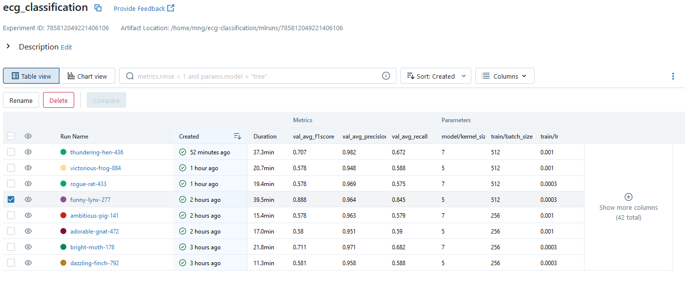
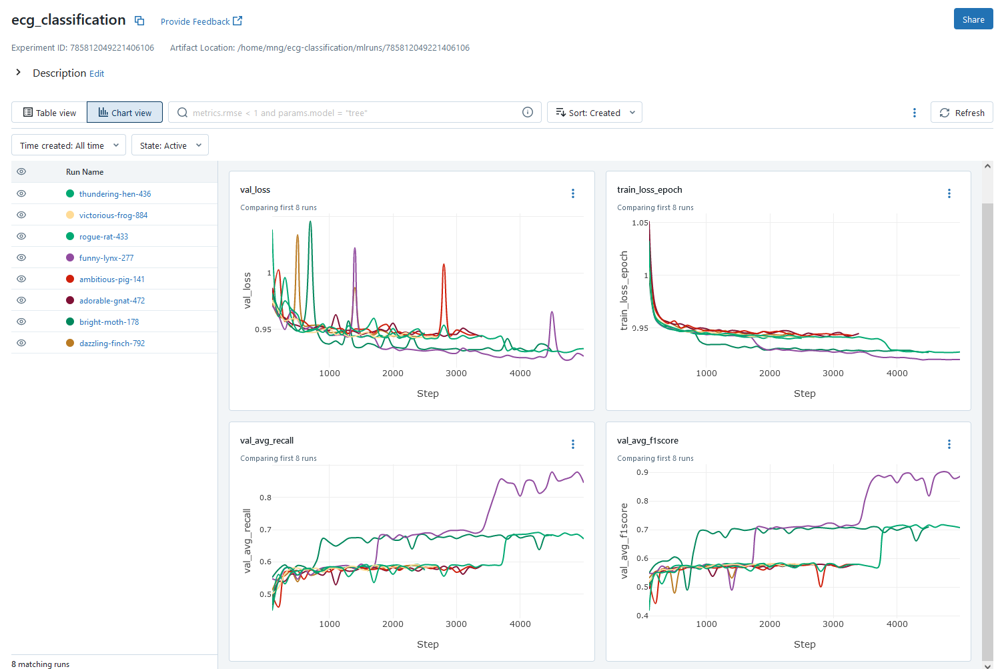

# Task 1: Data Processing
- Exploratory data analysis was done in
[notebooks/0.0-mng-exploratory-data-analysis.ipynb](../notebooks/0.0-mng-exploratory-data-analysis.ipynb).

- There were no missing values on the dataset and so no data
imputation was performed. If there were missing data, the appropriate
data imputation technique will depend on the type of feature / data.
In the case of ECG signals, interpolation to fill in missing timepoints
would be appropriate since ECG signals are continuous in time.

- Data augmentation is a technique used to improve the model's performance.
The main idea is to synthetically create new examples from the training
data by applying some transformations. This should lead to increased model
performance since there is more data for the model to learn from.
Domain knowledge would be helpful in creating appropriate augmentations.
The code for data augmentation can be found in [src/data/transforms.py](../src/data/transforms.py).
These have parameters such as the magnitude of the noise and can be varied
when called. We do the data augmentation during training while loading the
data, to create an "infinite" number of augmentations. The notebook in
[notebooks/0.1-mng-data-augmentation.ipynb](../notebooks/0.1-mng-data-augmentation.ipynb)
shows examples of the data augmentation as well as explanations for each.

# Task 2: Model Training and Fine-tuning
I chose a 1D convolutional neural network (CNN) model with 11 layers for
this ECG heartbeat categorization task. Neural networks automatically learn
features from the data and provides state-of-the-art results in several
tasks, especially when there is a lot of data. CNNs in particular have
translational equivariance properties built-in which makes them suitable
for image and signal processing tasks: the result of a convolution on a
shifted signal is the same as the shifting the convolution of the original
signal. A challenge with using neural networks is that they require a lot of
training data and may not generalize to out-of-distribution datasets.

To train the model, I split the training dataset into a training and
validation dataset, stratified by the label.

Note: This training/validation split potentially has some data leakage.
According to the [paper](https://arxiv.org/abs/1805.00794) on this dataset,
the MIT-BIH dataset was derived from ECG recordings from 47 subjects.
The ECG signals were split into 10 second windows and then pre-processed to
extract heartbeats. Ideally, when splitting the training dataset into
training/validation, we split at the patient level and then use the heartbeats
from the training/validation patients. However, I could not find patient
information from the Kaggle dataset.

I performed hyperparameter tuning by sweeping across the following combinations:

CNN Kernel size: {5, 7}

Learning rate: {1e-3, 3e-4}

Batch size: {256, 512}

This was facilitated with the use of Hydra. We could have swept more parameters
if we have time.

There are several metrics for multi-class classification problems.
These include accuracy, precision, recall, and F1-score. Since we
have highly imbalanced data with a lot of "normal" cases, the
accuracy will be skewed. A model which just predicts "normal" for
all cases will get high accuracy (>80%) instantly. Precision, recall
and F1-scores for the abnormal classes are therefore important metrics
to consider. Briefly, recall measures how much of the positive/disease
samples the model can detect. (Can the model detect arrhythmias?)
Precision tells us out of all samples that the model predicted to
be positive, how many of these are actually positive. (If a model
predicts a heartbeat to have arrhythmia, does it really have arrythmia?)
Both metrics are important: high recall means we will not miss
positive cases and high precision means we will not diagnose a
lot of cases as positive. The F1-score is a combination of the
precision and recall.

Early stopping is a technique used to prevent overfitting. Since
neural networks have way more parameters than training data, it
may overfit the training data. When this happens, the training loss
might still be decreasing but the validation loss could be increasing.
Early stopping stops the training process when some validation metric
is not moving in the right direction. In this case, I monitor the
validation average F1 score and stop training if it is not increasing.

I have also added a training callback to reduce the learning rate
when the validation loss plateaus. This helps in fitting the model.
A high initial learning rate helps the model train faster at the
beginning but in the later stages, it may cause the model to bounce
around the local minimum. Decreasing the learning rate would help
the model reach a local minimum.

From the hyperparameter sweep, the hyperparameters which produced the
highest validation average F1 score are: cnn kernel size = 5,
learning rate = 3e-4, and batch size = 512.

The training and validation loss curves can be visualized through MLflow.

The huge jump in the average recall and average F1 score curves are
likely due to the fact that there are only a few examples for some classes.

The performance of this model on the test set is as follows:

| Class                 |  Precision  |  Recall  |  F1 Score  |
|-----------------------|-------------|----------|------------|
| Normal (N)            |  0.981      |  0.998   |  0.99      |
| Supraventricular (S)  |  0.972      |  0.491   |  0.652     |
| Ventricular (V)       |  0.942      |  0.973   |  0.958     |
| Fusion (F)            |  0.85       |  0.735   |  0.788     |
| Unknown (Q)           |  1.0        |  0.968   |  0.984     |
| Average               |  0.949      |  0.833   |  0.874     |

The model clearly performs poorer on the classes with less examples:
Supraventricular (S) and Fusion (F).

Potential ideas for improvement:
- Oversampling the classes with fewer examples should help the
model predict these classes better. This can be done by specifying a
Sampler in the PyTorch Dataloader.

# (Optional) Task 3: Testing Holdout Set
Unfortunately, I did not have time to do this. I believe the main
idea here was to see whether the model trained on the MIT-BIH Arrhythmia
subset would generalize to the PTB Database subset.

# Task 4: Deployment Strategies
An important aspect when deploying the model is to ensure that the
pre-processing steps done before model training and validation are also
applied to the new data. To facilitate this, scripts to convert raw
data to processed data should be reproducible and kept in the same
repository as scripts for model training and validation.

Trained models could be stored as artifacts in a MLflow server.
To address model versioning, MLflow provides a model registry which
we can use. Models registered on the registry are provided a version
number and are linked to the MLflow run that produced the model.

For deployment, I believe the best approach is to package the application
and its dependencies into a container (i.e., Docker container).
Containerization allows for portability, scalability, and environment
consistency. Containers can be scaled out quickly using a container
orchestrator if there is an increase in demand.

The script to build the docker container would fetch a specific version
of the model from the model registry and copy the code for pre-processing and
generating predictions to form a complete application.

Monitoring the deployed system is another big task in real world.
Model predictions would presumably be displayed to the clinicians
to help them make decisions. However, to avoid bias, clinicians
should perform the classification independently without seeing the
model predictions. New data, model predictions on the new data,
as well as the clinician labels should be recorded in a database.
On a specific frequency, e.g., once a week, an application would
search through the database and compare model predictions with
clinician labels to check model performance. These results should
then be displayed on a dashboard or e-mailed to the model owners.
